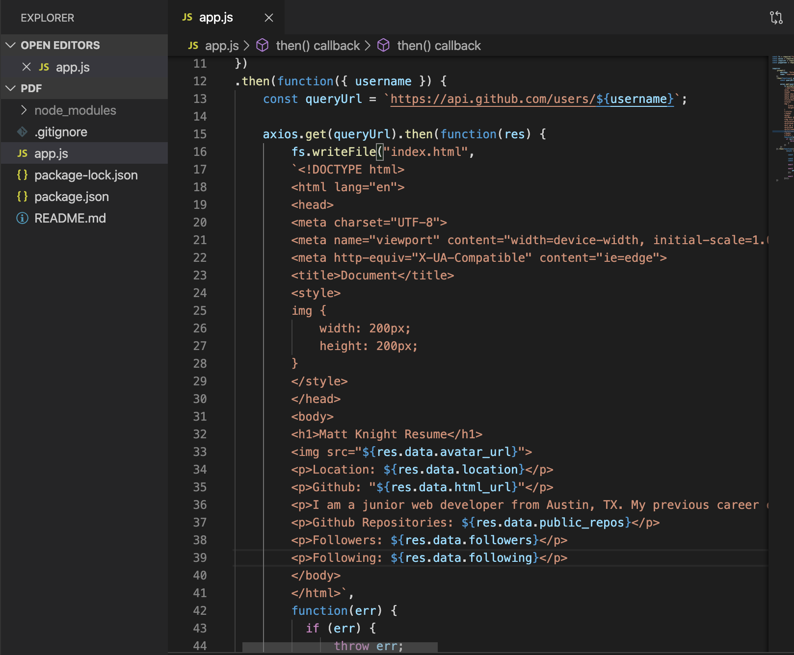
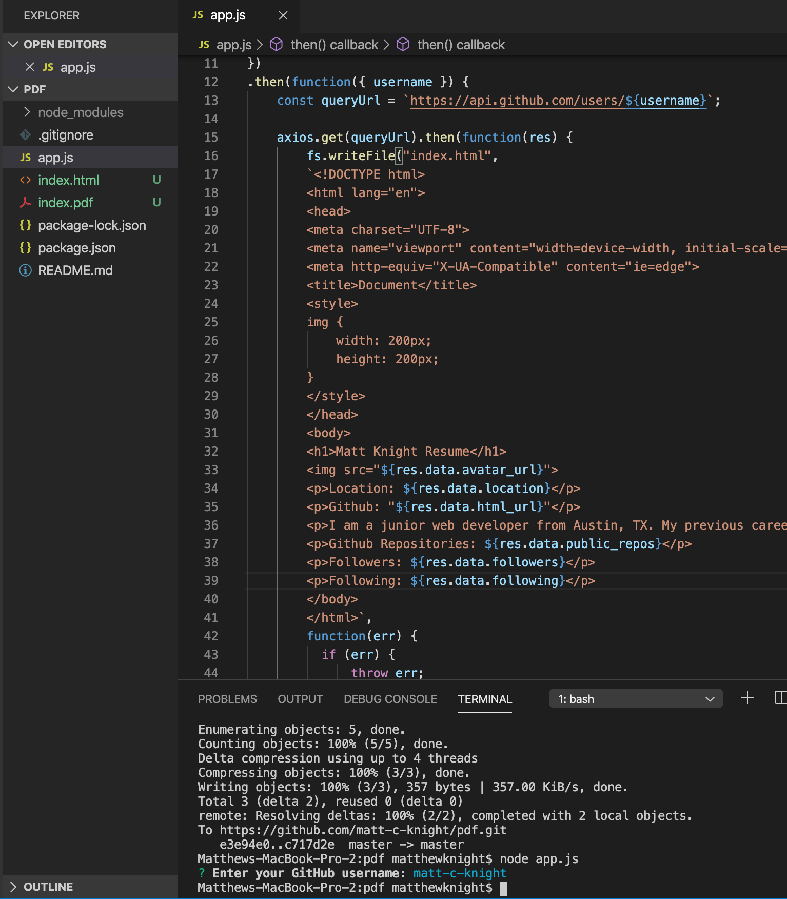

To begin my assignment I set up a gitignore so I can push it to github.

I set up a package.json with npm init.

I installed axios in order to hit the github api.

Installed inquirer so I can prompt the user for their github username.

I finally installed puppeteer, which is an npm package used to convert html to pdf.

Created my variable so I could use fs, axios, inquirer, and puppeteer in my program.

inquirer.prompt to get the user github.

.then promise to get a queryURL which I use in my axios api search.

Created an fs writefile to create html page using template literals.

Inserted the github data into the html based on the github developer api method res.data. (info)

after the fs writefile is completed, used the puppeteer syntax and asnyc await to convert the html to pdf.

